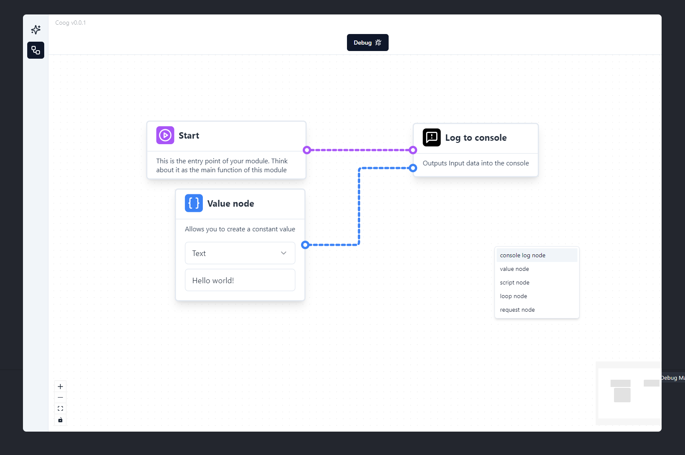

# Collective Cognition (COOG)



Welcome to the CooG project!

CooG aims to be a comprehensive AI tool and workspace for everyone. While this
is an ambitious goal, with the right implementation, we believe it’s possible to
build a versatile system capable of handling a wide range of tasks.

## Why Create CooG?

Current Large Language Models (LLMs) are impressive, offering the ability to
answer questions, perform calculations, and more. However, they are limited in
their ability to interact directly with devices and perform on-device actions.

CooG is designed to be an AI workspace that operates locally on your computer,
capable of executing a diverse range of actions you can imagine, beyond just
answering questions.

## How Is This Possible?

The honest answer is that it’s a challenging task 😅. It would be impossible for
one person to develop all potential actions. Instead of trying to build
everything myself, I’m adopting a more feasible approach.

## The Feasible Approach

With CooG, the goal is to create an extensible workspace where users can build
their own modules and share them with the community.

To achieve this, the following components are planned:

- **Standalone Desktop Application**: The core workspace environment where.
- **Internet Access**: For communication and data retrieval.
- **Audio & Video Recording**: Capture and process media inputs.
- **Screenshots**: Take snapshots of your screen.
- **Browser Interface**: Embed web functionalities within the app.
- **Mouse & Keyboard Control**: Interact with your system’s peripherals.
- **System Information**: Access details about the host machine.
- **JavaScript Runtime**: Support for executing JavaScript-based modules.
- **Short-Term & Long-Term Memory Databases**: Efficient data storage solutions.
- **Extensions Editor**: A web client dev tool where users can create custom
  modules to extend CooGs functionality.
- **Chat Interface**: Engage with the AI through a conversational UI.
- **Notifications System**: Alert users about various events and actions.

## Technologies

CooG leverages the following technologies:

- **Electron**: For a multi-platform local client.
- **TypeScript**: As language to create new extensions/modules.
- **Nodejs**: JavaScript runtime.
- **SQLite**: Local database for storing data.

## Features

- **Custom Workflow Automation**:
  - Users can create automated workflows that chain multiple actions (e.g.,
    triggering a sequence of tasks based on conditions or schedules).
  - Automates repetitive tasks, making the workspace more efficient and
    powerful.

- **Plugin Marketplace**:
  - A marketplace or community hub where users can share, download, and rate
    extensions or plugins.
  - Encourages community engagement, collaboration, and ecosystem growth.

- **AI-Assisted Code Generation & Debugging**:
  - An AI-powered code editor to help with writing and debugging code,
    especially for developing extensions.
  - Lowers the barrier for users who want to create custom modules, even if they
    are not proficient coders.

- **Voice Command Support**:
  - Integration of voice command functionalities to control the workspace or
    execute actions via voice.
  - Provides a hands-free interaction method, useful for accessibility and
    multitasking.

- **Cross-Device Sync**:
  - Sync data and configurations across multiple devices, enabling seamless
    workspace access from different computers.
  - Facilitates continuity, allowing users to work from anywhere.

- **Advanced Data Visualization**:
  - Tools to visualize data from various sources (e.g., graphs, charts,
    dashboards) within the workspace.
  - Useful for analyzing information or monitoring processes in real-time.

- **Secure Environment Management (Virtual Machines/Containers)**:
  - Support for running tasks or actions in isolated environments (e.g., Docker
    containers or VMs) to ensure security and stability.
  - Safely execute potentially risky actions without affecting the main system,
    especially for running third-party modules.

- **AI-Enhanced User Support & Tutorials**:
  - A built-in assistant that guides users through setup, usage, and
    troubleshooting of features, including extension creation and management.
  - Enhances user experience, helping newcomers get started and understand the
    full capabilities of CooG.

- **Real-Time Collaboration Tools**:
  - Allow multiple users to collaborate on tasks or projects within the
    workspace, similar to Google Docs or VS Code Live Share.
  - Facilitates teamwork, enabling real-time interaction and problem-solving.

- **Event Trigger System**:
  - Users can set up event-based triggers (e.g., “if system temperature exceeds
    80°C, send notification,” or “when email is received, execute a script”).
  - Adds flexibility and power to automation, allowing users to customize their
    workspace according to their needs.

---

## Recommended IDE Setup

- [VSCode](https://code.visualstudio.com/) +
  [ESLint](https://marketplace.visualstudio.com/items?itemName=dbaeumer.vscode-eslint) +
  [Prettier](https://marketplace.visualstudio.com/items?itemName=esbenp.prettier-vscode)

## Project Setup

### Install

```bash
$ npm install
```

### Development

```bash
$ npm run dev
```

### Build

```bash
# For windows
$ npm run build:win

# For macOS
$ npm run build:mac

# For Linux
$ npm run build:linux
```
